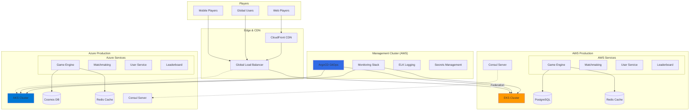
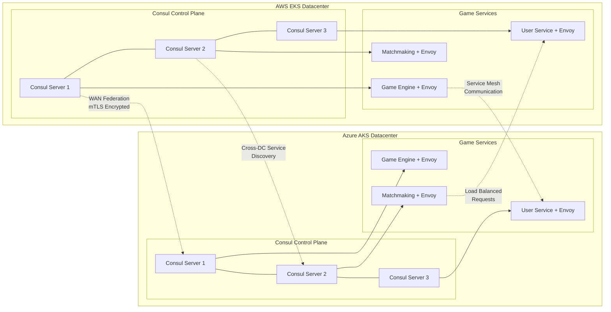
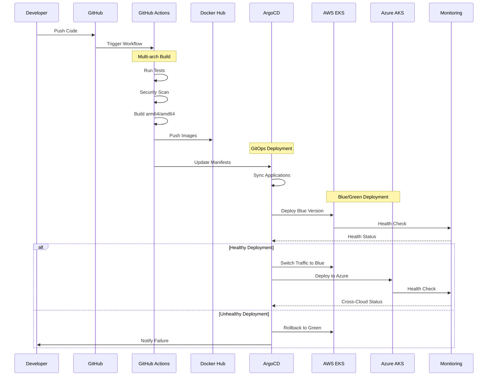
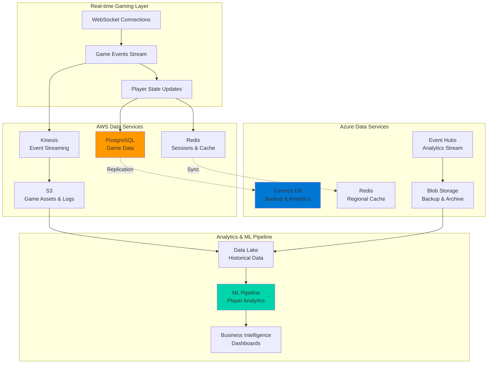
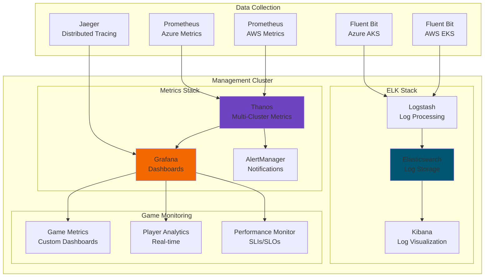
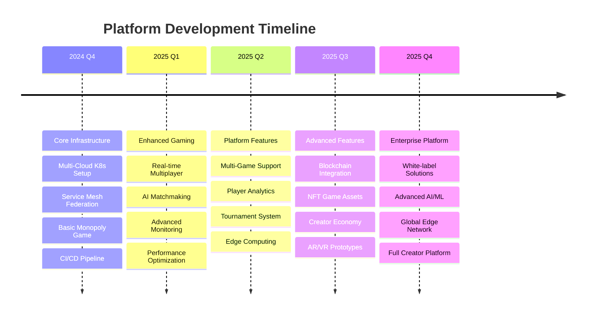
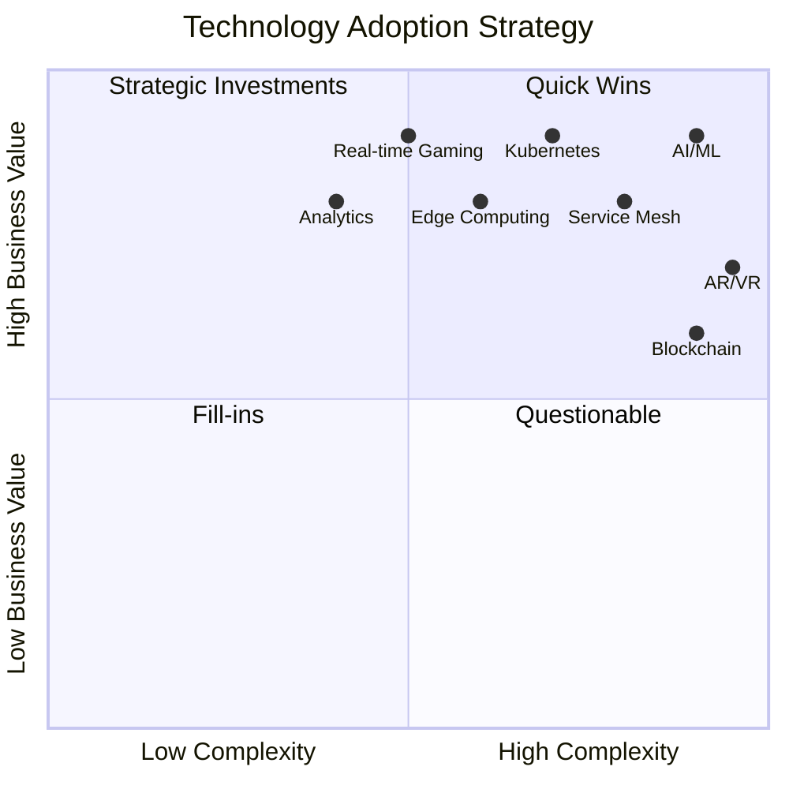
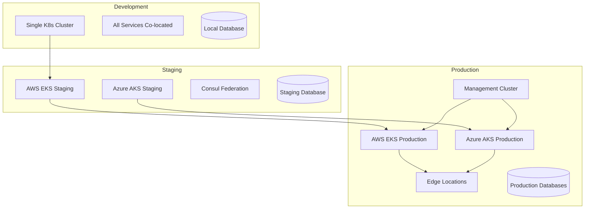

# Multi-Cloud Gaming Platform - Architecture Blueprint

## System Overview

## Service Mesh Architecture

## CI/CD Pipeline Flow

## Data Architecture & Flow

## Monitoring & Observability Stack

## Gaming Platform Evolution Roadmap

## Technology Stack Matrix

## Deployment Architecture by Environment

## Recommended Tooling Strategy

### **Primary Tools (Diagrams as Code)**
- **Mermaid**: Embedded in GitHub, live documentation
- **Diagrams.py**: Infrastructure diagrams, auto-generated
- **PlantUML**: Detailed sequence and component diagrams

### **Secondary Tools (Visual Design)**
- **Lucidchart**: Executive presentations
- **Draw.io**: Quick sketches and brainstorming
- **AWS/Azure Architecture Tools**: Cloud-specific designs

### **Maintenance Workflow**
1. **Code Changes** → Auto-generate diagrams via CI/CD
2. **Weekly Reviews** → Update documentation and validate accuracy
3. **Monthly Architecture Reviews** → Comprehensive diagram audit
4. **Quarterly Roadmap Updates** → Evolution timeline updates

### **Integration Strategy**
- **GitHub Actions**: Auto-generate diagrams on code changes
- **Documentation Sites**: GitBook or custom site with embedded diagrams
- **Team Collaboration**: VS Code extensions for live preview
- **Version Control**: All diagrams stored in Git with code

This blueprint provides a comprehensive visual representation of your multi-cloud gaming platform, from current state through future evolution, with maintainable documentation practices.
