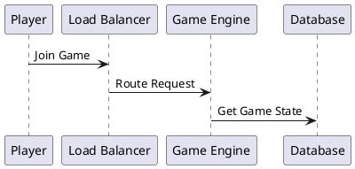

# Architecture Diagrams & Documentation Strategy

## Recommended Tooling Stack

### **Primary Recommendation: Diagrams as Code** ✅

#### **1. Diagrams.py (Python-based)**
```python
# Infrastructure diagrams that auto-update with code changes
from diagrams import Diagram
from diagrams.aws.compute import EKS
from diagrams.azure.compute import AKS
from diagrams.k8s.compute import Pod

# Generates PNG/SVG diagrams from code
with Diagram("Multi-Cloud Gaming Platform", show=False):
    eks = EKS("AWS EKS")
    aks = AKS("Azure AKS")
    game_pods = Pod("Game Services")
```

**Benefits:**
- **Version Controlled**: Diagrams live in Git with code
- **Auto-Generated**: Update diagrams when architecture changes
- **Consistent Style**: Standardized cloud provider icons
- **CI/CD Integration**: Generate diagrams in pipeline

#### **2. Mermaid (Markdown-based)**
```mermaid
# Embedded in documentation, renders in GitHub
graph TB
    A[Player] --> B[Load Balancer]
    B --> C[AWS EKS]
    B --> D[Azure AKS]
    C --> E[Game Services]
    D --> F[Game Services]
```

**Benefits:**
- **GitHub Native**: Renders directly in README files
- **Lightweight**: Text-based, easy to edit
- **Multiple Types**: Flowcharts, sequence, Gantt charts
- **Real-time Preview**: Live editing in VS Code

#### **3. PlantUML (UML-based)**


### **Secondary Tools for Specific Use Cases**

#### **4. Lucidchart/Draw.io (Visual Editing)**
- **Use Case**: Executive presentations, high-level overviews
- **Benefits**: Professional appearance, collaborative editing
- **Drawbacks**: Not version controlled, manual updates

#### **5. AWS/Azure Architecture Tools**
- **AWS Architecture Icons**: Official AWS diagram templates
- **Azure Architecture Center**: Microsoft's diagram standards
- **Use Case**: Cloud-specific detailed designs

## Diagram Categories & Maintenance Strategy

### **1. System Architecture Diagrams**
```python
# File: diagrams/system_architecture.py
from diagrams import Diagram, Cluster, Edge
from diagrams.aws.compute import EKS
from diagrams.azure.compute import AKS
from diagrams.onprem.compute import Server

with Diagram("Multi-Cloud Gaming Platform - System Overview", show=False, direction="TB"):
    
    with Cluster("Management Cluster"):
        argocd = Server("ArgoCD")
        monitoring = Server("Monitoring Stack")
    
    with Cluster("AWS Production"):
        aws_eks = EKS("EKS Cluster")
        aws_games = Server("Game Services")
    
    with Cluster("Azure Production"):
        azure_aks = AKS("AKS Cluster")
        azure_games = Server("Game Services")
    
    # Relationships
    argocd >> Edge(label="deploys") >> [aws_games, azure_games]
    monitoring >> Edge(label="monitors") >> [aws_games, azure_games]
```

### **2. Service Mesh Architecture**
```mermaid
# File: docs/service-mesh-architecture.md
graph TB
    subgraph "AWS EKS"
        A1[Game Engine]
        A2[Matchmaking]
        A3[User Service]
        CS1[Consul Server]
    end
    
    subgraph "Azure AKS"
        B1[Game Engine]
        B2[Matchmaking]
        B3[User Service]
        CS2[Consul Server]
    end
    
    CS1 -.->|Federation| CS2
    A1 -.->|Service Discovery| B1
```

### **3. Data Flow Diagrams**
```python
# File: diagrams/data_flow.py
from diagrams import Diagram, Cluster
from diagrams.aws.analytics import Kinesis
from diagrams.aws.database import RDS
from diagrams.onprem.analytics import Kafka

with Diagram("Gaming Data Pipeline", show=False):
    
    with Cluster("Real-time Data"):
        game_events = Kafka("Game Events")
        player_actions = Kinesis("Player Actions")
    
    with Cluster("Storage"):
        game_db = RDS("Game Database")
        analytics_db = RDS("Analytics DB")
    
    game_events >> analytics_db
    player_actions >> game_db
```

### **4. Deployment Pipeline Diagrams**
```mermaid
# File: docs/cicd-pipeline.md
sequenceDiagram
    participant Dev as Developer
    participant GH as GitHub
    participant DH as Docker Hub
    participant AC as ArgoCD
    participant K8s as Kubernetes

    Dev->>GH: Push Code
    GH->>GH: Run Tests
    GH->>DH: Build & Push Image
    GH->>AC: Update Manifests
    AC->>K8s: Deploy Application
    K8s->>AC: Health Status
```

## Documentation Structure

### **Repository Organization**
```
/docs/
├── architecture/
│   ├── system-overview.md
│   ├── service-mesh.md
│   ├── data-architecture.md
│   └── security-model.md
├── diagrams/
│   ├── system_architecture.py
│   ├── data_flow.py
│   ├── deployment_pipeline.py
│   └── generated/          # Auto-generated images
├── roadmap/
│   ├── platform-roadmap.md
│   ├── feature-timeline.md
│   └── technology-evolution.md
└── operations/
    ├── runbooks/
    ├── monitoring/
    └── disaster-recovery/
```

### **Automated Diagram Generation**
```yaml
# .github/workflows/generate-diagrams.yml
name: Generate Architecture Diagrams

on:
  push:
    paths: ['diagrams/**', 'docs/**']

jobs:
  generate:
    runs-on: ubuntu-latest
    steps:
      - uses: actions/checkout@v4
      
      - name: Setup Python
        uses: actions/setup-python@v4
        with:
          python-version: '3.9'
          
      - name: Install dependencies
        run: |
          pip install diagrams
          
      - name: Generate diagrams
        run: |
          cd diagrams
          python system_architecture.py
          python data_flow.py
          
      - name: Commit generated diagrams
        run: |
          git config --local user.email "action@github.com"
          git config --local user.name "GitHub Action"
          git add diagrams/generated/
          git commit -m "Auto-update architecture diagrams" || exit 0
          git push
```

## Interactive Documentation Strategy

### **1. Living Documentation**
```markdown
# docs/README.md with embedded diagrams

## System Architecture


## Current Status
- ✅ AWS EKS Cluster: Deployed
- ✅ Service Mesh: Consul Federation
- 🚧 Azure AKS: In Progress
- 📋 Monitoring: Planned

## Quick Links
- [Deployment Guide](operations/deployment.md)
- [Monitoring Dashboard](http://monitoring.monopoly-platform.com)
- [ArgoCD UI](http://argocd.monopoly-platform.com)
```

### **2. Architecture Decision Records (ADRs)**
```markdown
# docs/adr/001-service-mesh-selection.md

# ADR-001: Service Mesh Selection

## Status
Accepted

## Context
Need service mesh for multi-cloud communication

## Decision
Use Consul Connect for cross-datacenter federation

## Consequences
- ✅ Multi-cloud service discovery
- ✅ mTLS encryption
- ❌ Learning curve for team
```

### **3. Runbook Integration**
```markdown
# docs/operations/runbooks/service-mesh-troubleshooting.md

## Service Mesh Issues

### Consul Federation Down


**Symptoms:** Cross-cloud services unreachable
**Investigation:** Check consul members across datacenters
**Resolution:** Restart consul servers in sequence
```

## Maintenance Workflow

### **Weekly Updates**
1. **Automated**: Diagrams regenerate on code changes
2. **Manual Review**: Validate diagram accuracy
3. **Documentation Sync**: Update text to match diagrams
4. **Stakeholder Review**: Share updates with team

### **Monthly Architecture Reviews**
1. **Diagram Audit**: Ensure all components represented
2. **Roadmap Updates**: Reflect completed and planned features
3. **Tool Evaluation**: Assess if current tools meet needs
4. **Knowledge Sharing**: Team walkthrough of architecture

## Tool Recommendations Summary

### **For Your Gaming Platform:**

**Primary Stack:**
- **Diagrams.py**: Infrastructure and system diagrams
- **Mermaid**: Sequence diagrams and simple flowcharts
- **GitHub**: Version control and automated generation

**Secondary Tools:**
- **Lucidchart**: Executive presentations
- **PlantUML**: Detailed UML diagrams
- **AWS/Azure Tools**: Cloud-specific designs

**Integration:**
- **VS Code Extensions**: Mermaid preview, PlantUML
- **GitHub Actions**: Automated diagram generation
- **Documentation Sites**: GitBook, Notion, or custom site

This approach ensures your architecture documentation stays current, accessible, and professional while being maintainable by your development team.
