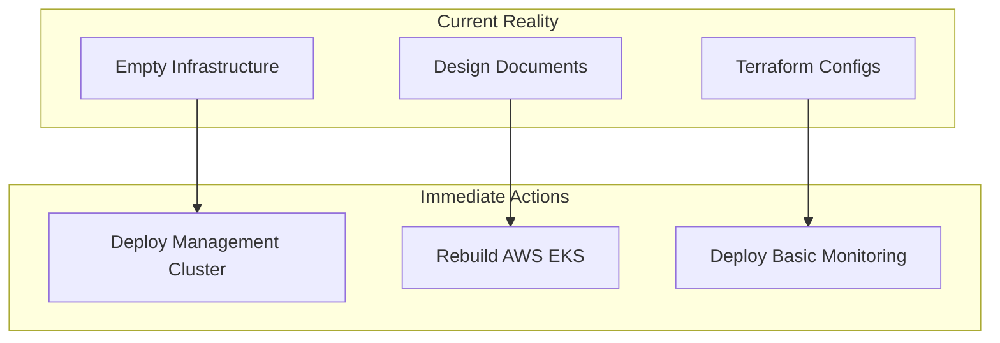
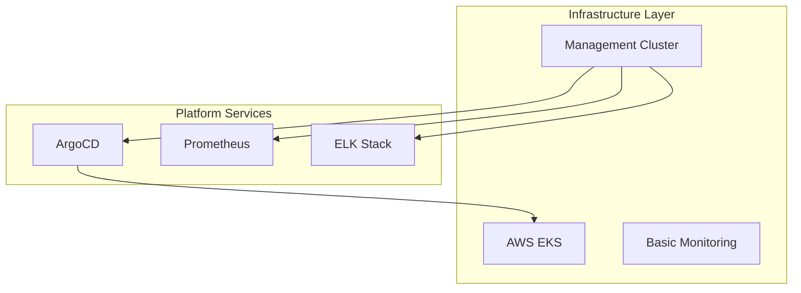
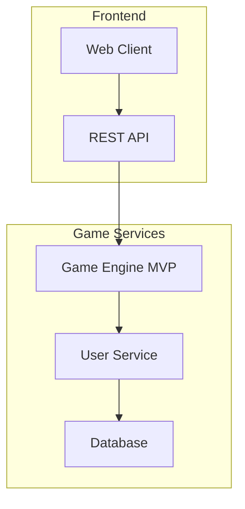

# Architecture Blueprint Review & Validation

## Current State Analysis

### ✅ **What's Actually Deployed**
```yaml
infrastructure_status:
  aws_eks: "DESTROYED (empty terraform state)"
  azure_aks: "DESTROYED (empty terraform state)" 
  consul_federation: "DESTROYED (empty terraform state)"
  management_cluster: "NOT DEPLOYED"
  monitoring_stack: "NOT DEPLOYED"
  argocd: "NOT DEPLOYED"

application_status:
  monopoly_game: "DESIGN PHASE (README only)"
  cicd_pipeline: "TEMPLATES CREATED"
  service_mesh: "CONFIGURED BUT NOT DEPLOYED"
```

### 📋 **What's Documented vs Reality**

#### **Infrastructure Gap Analysis**
| Component | Blueprint Status | Actual Status | Gap |
|-----------|------------------|---------------|-----|
| AWS EKS | ✅ Production Ready | ❌ Destroyed | **CRITICAL** |
| Azure AKS | ✅ Production Ready | ❌ Destroyed | **CRITICAL** |
| Management Cluster | ✅ Designed | ❌ Not Created | **HIGH** |
| Consul Federation | ✅ Configured | ❌ Not Running | **HIGH** |
| Monitoring Stack | ✅ Designed | ❌ Not Deployed | **MEDIUM** |
| ArgoCD | ✅ Strategy Defined | ❌ Not Installed | **MEDIUM** |

#### **Application Gap Analysis**
| Component | Blueprint Status | Actual Status | Gap |
|-----------|------------------|---------------|-----|
| Monopoly Game | ✅ Microservices Design | ❌ No Code | **CRITICAL** |
| Game Engine | ✅ Architecture Defined | ❌ Not Implemented | **CRITICAL** |
| Matchmaking | ✅ Service Designed | ❌ Not Built | **HIGH** |
| User Management | ✅ Auth Strategy | ❌ No Implementation | **HIGH** |
| Real-time Communication | ✅ WebSocket Design | ❌ No Code | **HIGH** |

## Blueprint Accuracy Assessment

### 🎯 **Accurate Architectural Decisions**
- ✅ **Multi-cloud strategy**: AWS primary, Azure secondary is sound
- ✅ **Service mesh choice**: Consul is appropriate for multi-cloud
- ✅ **GitOps approach**: ArgoCD + GitHub Actions is industry best practice
- ✅ **Monitoring strategy**: Dedicated cluster approach is cost-effective
- ✅ **Microservices design**: Game services separation is well-architected

### ⚠️ **Blueprint Assumptions to Validate**
- **Network Latency**: Cross-cloud communication impact on gaming experience
- **Data Consistency**: Real-time game state sync between AWS/Azure
- **Cost Projections**: Actual multi-cloud costs vs estimates
- **Scaling Patterns**: Gaming workload scaling behavior
- **Disaster Recovery**: RTO/RPO requirements for gaming platform

### ❌ **Blueprint Inaccuracies**
- **Current State**: Diagrams show deployed infrastructure (not reality)
- **Implementation Timeline**: Overly optimistic for gaming complexity
- **Resource Requirements**: May underestimate gaming workload needs
- **Security Model**: Missing gaming-specific security requirements

## Corrected Architecture Roadmap

### **Phase 0: Foundation Recovery (Week 1-2)**


### **Phase 1: Core Infrastructure (Week 3-4)**


### **Phase 2: Game Development (Week 5-8)**


## Revised Implementation Priority

### **Critical Path (Must Have)**
1. **Management Cluster**: Deploy monitoring and ArgoCD first
2. **AWS EKS**: Single cloud MVP before multi-cloud
3. **Basic Game**: Simple Monopoly before advanced features
4. **CI/CD Pipeline**: Automated deployment foundation

### **High Priority (Should Have)**
1. **Azure AKS**: Add second cloud for redundancy
2. **Service Mesh**: Consul federation between clouds
3. **Real-time Features**: WebSocket multiplayer
4. **Advanced Monitoring**: Gaming-specific metrics

### **Medium Priority (Nice to Have)**
1. **AI Matchmaking**: Smart player pairing
2. **Edge Computing**: Global performance optimization
3. **Advanced Analytics**: Player behavior insights
4. **Security Hardening**: Production-grade security

### **Future Enhancements (Could Have)**
1. **Multi-Game Platform**: Beyond Monopoly
2. **Blockchain Integration**: NFTs and crypto rewards
3. **AR/VR Features**: Immersive gaming
4. **Enterprise Features**: B2B gaming solutions

## Technical Debt & Risks

### **Current Technical Debt**
- **Infrastructure**: All clusters need rebuilding from scratch
- **Application**: No actual game code exists yet
- **Documentation**: Blueprint ahead of implementation
- **Testing**: No testing strategy defined

### **Risk Mitigation**
```yaml
risks:
  infrastructure_complexity:
    risk: "Multi-cloud setup too complex for MVP"
    mitigation: "Start single-cloud, add Azure later"
    
  gaming_performance:
    risk: "Cross-cloud latency affects gameplay"
    mitigation: "Implement regional routing and caching"
    
  development_timeline:
    risk: "Overambitious roadmap"
    mitigation: "Focus on MVP, iterate quickly"
    
  cost_overrun:
    risk: "Multi-cloud costs exceed budget"
    mitigation: "Start small, monitor costs closely"
```

## Recommended Next Steps

### **Immediate Actions (This Week)**
1. **Deploy Management Cluster**: Start with monitoring infrastructure
2. **Rebuild AWS EKS**: Single cluster for MVP development
3. **Create Game MVP**: Basic Monopoly game logic
4. **Set up CI/CD**: GitHub Actions + ArgoCD basics

### **Short Term (Next Month)**
1. **Add Azure AKS**: Implement multi-cloud redundancy
2. **Deploy Service Mesh**: Consul federation
3. **Implement Real-time**: WebSocket multiplayer features
4. **Add Monitoring**: Gaming-specific observability

### **Medium Term (Next Quarter)**
1. **Performance Optimization**: Edge computing and caching
2. **Advanced Features**: AI matchmaking, tournaments
3. **Security Hardening**: Production-grade security
4. **Platform Expansion**: Multi-game architecture

This review reveals that while the architectural vision is sound, there's significant work needed to align reality with the blueprint. The corrected roadmap provides a more realistic path forward.
