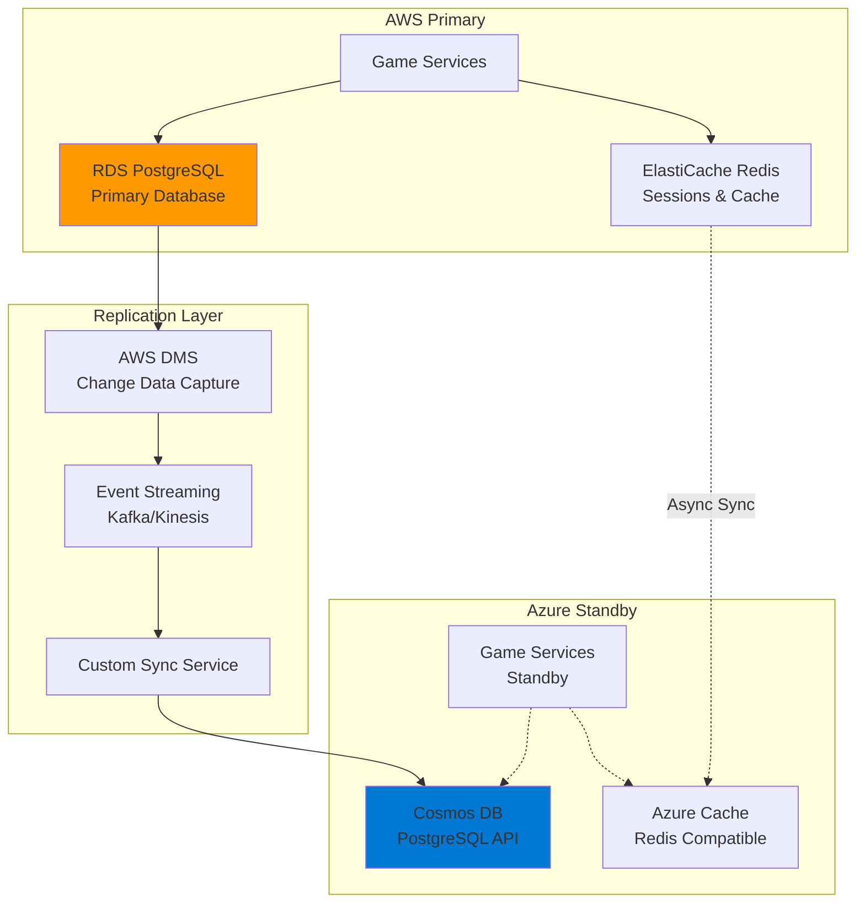

# Cross-Cloud Database Failover Strategy

## **Database Architecture for Gaming Platform**

### **Primary Setup: AWS RDS PostgreSQL → Azure Cosmos DB**



## **Implementation Methods**

### **Method 1: Logical Replication (Recommended for Gaming)**

#### **AWS RDS Configuration**
```sql
-- Enable logical replication on AWS RDS
ALTER SYSTEM SET wal_level = logical;
ALTER SYSTEM SET max_replication_slots = 10;
ALTER SYSTEM SET max_wal_senders = 10;

-- Create publication for game tables
CREATE PUBLICATION game_replication FOR ALL TABLES;

-- Create replication slot
SELECT pg_create_logical_replication_slot('azure_replica', 'pgoutput');
```

#### **Azure Cosmos DB Setup**
```yaml
# Cosmos DB with PostgreSQL API
cosmos_config:
  api: "PostgreSQL"
  consistency_level: "Strong"
  multi_region: false
  backup_policy: "Continuous"
  
  # Gaming-optimized settings
  throughput: "4000 RU/s (auto-scale)"
  partition_key: "/game_id"
  indexing_policy: "Optimized for queries"
```

#### **Custom Sync Service**
```javascript
// Node.js replication service
const { Client } = require('pg');
const { CosmosClient } = require('@azure/cosmos');

class DatabaseReplicator {
  constructor() {
    this.awsClient = new Client({
      host: process.env.AWS_RDS_HOST,
      database: 'monopoly_game',
      user: 'replication_user',
      password: process.env.RDS_PASSWORD
    });
    
    this.azureClient = new CosmosClient({
      endpoint: process.env.COSMOS_ENDPOINT,
      key: process.env.COSMOS_KEY
    });
  }
  
  async startReplication() {
    // Subscribe to logical replication stream
    const stream = await this.awsClient.query(`
      SELECT * FROM pg_logical_slot_get_changes(
        'azure_replica', NULL, NULL, 
        'proto_version', '1', 
        'publication_names', 'game_replication'
      )
    `);
    
    stream.on('data', async (change) => {
      await this.applyChangeToAzure(change);
    });
  }
  
  async applyChangeToAzure(change) {
    const { table, operation, data } = this.parseChange(change);
    
    switch(operation) {
      case 'INSERT':
        await this.insertToAzure(table, data);
        break;
      case 'UPDATE':
        await this.updateInAzure(table, data);
        break;
      case 'DELETE':
        await this.deleteFromAzure(table, data);
        break;
    }
  }
}
```

### **Method 2: AWS DMS + Event Streaming**

#### **DMS Configuration**
```yaml
# AWS DMS replication instance
dms_setup:
  instance_class: "dms.t3.medium"
  engine_version: "3.4.7"
  
  source_endpoint:
    engine: "postgres"
    server_name: "${aws_rds_endpoint}"
    database_name: "monopoly_game"
    
  target_endpoint:
    engine: "postgres"  # Cosmos DB PostgreSQL API
    server_name: "${azure_cosmos_endpoint}"
    database_name: "monopoly_game"
    
  replication_task:
    migration_type: "full-load-and-cdc"
    table_mappings: |
      {
        "rules": [
          {
            "rule-type": "selection",
            "rule-id": "1",
            "rule-name": "game-tables",
            "object-locator": {
              "schema-name": "public",
              "table-name": "%"
            },
            "rule-action": "include"
          }
        ]
      }
```

## **Failover Automation**

### **Health Check & Detection**
```yaml
# Kubernetes health check service
apiVersion: apps/v1
kind: Deployment
metadata:
  name: db-health-monitor
spec:
  template:
    spec:
      containers:
      - name: health-checker
        image: monopoly/db-health-checker
        env:
        - name: AWS_RDS_ENDPOINT
          value: "monopoly-prod.cluster-xyz.us-west-2.rds.amazonaws.com"
        - name: AZURE_COSMOS_ENDPOINT
          value: "monopoly-cosmos.documents.azure.com"
        - name: CHECK_INTERVAL
          value: "10s"
        - name: FAILURE_THRESHOLD
          value: "3"
```

#### **Health Check Logic**
```javascript
// Database health monitoring
class DatabaseHealthChecker {
  async checkAWSHealth() {
    try {
      const result = await this.awsClient.query('SELECT 1');
      const latency = Date.now() - startTime;
      
      return {
        healthy: true,
        latency: latency,
        timestamp: new Date()
      };
    } catch (error) {
      return {
        healthy: false,
        error: error.message,
        timestamp: new Date()
      };
    }
  }
  
  async triggerFailover() {
    console.log('AWS database failure detected, initiating failover...');
    
    // 1. Stop writes to AWS
    await this.setMaintenanceMode(true);
    
    // 2. Ensure Azure is caught up
    await this.waitForReplicationSync();
    
    // 3. Switch application to Azure
    await this.updateDatabaseEndpoint('azure');
    
    // 4. Resume operations
    await this.setMaintenanceMode(false);
    
    console.log('Failover completed successfully');
  }
}
```

### **Application-Level Failover**
```javascript
// Database connection manager with failover
class GameDatabaseManager {
  constructor() {
    this.primaryConfig = {
      host: process.env.PRIMARY_DB_HOST,
      database: 'monopoly_game',
      user: process.env.DB_USER,
      password: process.env.DB_PASSWORD,
      pool: { min: 5, max: 20 }
    };
    
    this.failoverConfig = {
      host: process.env.FAILOVER_DB_HOST,
      database: 'monopoly_game',
      user: process.env.DB_USER,
      password: process.env.DB_PASSWORD,
      pool: { min: 5, max: 20 }
    };
    
    this.currentConnection = 'primary';
    this.setupHealthChecks();
  }
  
  async query(sql, params) {
    try {
      if (this.currentConnection === 'primary') {
        return await this.primaryPool.query(sql, params);
      } else {
        return await this.failoverPool.query(sql, params);
      }
    } catch (error) {
      if (this.isConnectionError(error)) {
        await this.handleConnectionFailure();
        // Retry with failover connection
        return await this.failoverPool.query(sql, params);
      }
      throw error;
    }
  }
  
  async handleConnectionFailure() {
    console.log('Primary database connection failed, switching to failover...');
    this.currentConnection = 'failover';
    
    // Notify monitoring systems
    await this.sendAlert('Database failover initiated');
    
    // Update service discovery
    await this.updateServiceEndpoint();
  }
}
```

## **Gaming-Specific Considerations**

### **Session Data Failover**
```javascript
// Redis session replication for gaming
class SessionReplicator {
  async replicateGameSessions() {
    const sessions = await this.awsRedis.keys('game:session:*');
    
    for (const sessionKey of sessions) {
      const sessionData = await this.awsRedis.get(sessionKey);
      await this.azureRedis.set(sessionKey, sessionData, 'EX', 3600);
    }
  }
  
  async failoverSessions() {
    // Ensure all active game sessions are available in Azure
    await this.replicateGameSessions();
    
    // Update session store configuration
    process.env.REDIS_ENDPOINT = process.env.AZURE_REDIS_ENDPOINT;
    
    // Reconnect Redis clients
    await this.reconnectRedisClients();
  }
}
```

### **Game State Consistency**
```sql
-- Ensure game state consistency during failover
CREATE OR REPLACE FUNCTION check_game_consistency()
RETURNS TABLE(game_id UUID, aws_state JSONB, azure_state JSONB, consistent BOOLEAN)
AS $$
BEGIN
  RETURN QUERY
  SELECT 
    g.id,
    g.game_state as aws_state,
    a.game_state as azure_state,
    (g.game_state = a.game_state) as consistent
  FROM games g
  LEFT JOIN azure_games_replica a ON g.id = a.id
  WHERE g.updated_at > NOW() - INTERVAL '1 hour';
END;
$$ LANGUAGE plpgsql;
```

## **Failover Testing & Validation**

### **Automated Failover Testing**
```yaml
# Chaos engineering for database failover
apiVersion: batch/v1
kind: CronJob
metadata:
  name: db-failover-test
spec:
  schedule: "0 2 * * 0"  # Weekly at 2 AM Sunday
  jobTemplate:
    spec:
      template:
        spec:
          containers:
          - name: failover-tester
            image: monopoly/failover-tester
            command:
            - /bin/sh
            - -c
            - |
              echo "Starting database failover test..."
              
              # 1. Verify replication lag
              ./check-replication-lag.sh
              
              # 2. Simulate AWS failure
              ./simulate-db-failure.sh
              
              # 3. Verify Azure takeover
              ./verify-failover.sh
              
              # 4. Test game functionality
              ./test-game-operations.sh
              
              # 5. Restore AWS and failback
              ./restore-primary.sh
              
              echo "Failover test completed"
```

### **Performance Validation**
```javascript
// Validate database performance after failover
class FailoverValidator {
  async validatePerformance() {
    const tests = [
      this.testGameCreation(),
      this.testPlayerJoin(),
      this.testGameStateUpdate(),
      this.testLeaderboardQuery()
    ];
    
    const results = await Promise.all(tests);
    
    const avgLatency = results.reduce((sum, r) => sum + r.latency, 0) / results.length;
    
    if (avgLatency > 100) { // 100ms threshold for gaming
      throw new Error(`Failover performance degraded: ${avgLatency}ms average`);
    }
    
    return { success: true, avgLatency };
  }
}
```

## **Monitoring & Alerting**

### **Key Metrics**
```yaml
database_metrics:
  replication_lag:
    threshold: "5 seconds"
    alert: "critical"
    
  connection_pool_usage:
    threshold: "80%"
    alert: "warning"
    
  query_performance:
    threshold: "100ms p95"
    alert: "warning"
    
  failover_time:
    target: "<2 minutes"
    measurement: "end-to-end"
```

### **Alerting Configuration**
```yaml
# Prometheus alerting rules
groups:
- name: database.rules
  rules:
  - alert: DatabaseReplicationLag
    expr: database_replication_lag_seconds > 5
    for: 30s
    labels:
      severity: critical
    annotations:
      summary: "Database replication lag is high"
      
  - alert: DatabaseConnectionFailure
    expr: database_connection_failures_total > 3
    for: 1m
    labels:
      severity: critical
    annotations:
      summary: "Multiple database connection failures detected"
```

This comprehensive database failover strategy ensures **<2 minute RTO** and **<30 second RPO** for your gaming platform, maintaining player experience during cloud provider failures.
