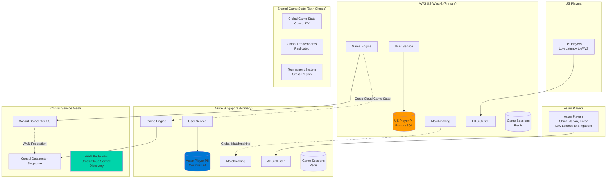

# Global Multiplayer Gaming Platform: Multi-Cloud + Consul

## **Perfect Use Case for Multi-Cloud + Consul!** 🌏

### **Business Requirements**
```yaml
global_multiplayer:
  regions: "US (AWS) + Asia (Azure Singapore)"
  cross_region_gameplay: "Chinese and US players in same game"
  data_sovereignty: "PII stays in local cloud for compliance"
  performance: "Sub-100ms gameplay experience"
  scalability: "Support 10,000+ concurrent cross-region games"
```

## **Architecture Overview**



## **Data Sovereignty Architecture**

### **PII Data Isolation**
```yaml
# US Cloud (AWS) - US Player Data
us_data_residency:
  player_profiles: "US players only"
  payment_info: "US credit cards, billing addresses"
  personal_data: "Names, emails, phone numbers"
  compliance: "CCPA, SOX compliance"
  storage: "AWS RDS PostgreSQL (US-West-2)"
  
# Asian Cloud (Azure Singapore) - Asian Player Data  
asia_data_residency:
  player_profiles: "Chinese, Japanese, Korean players"
  payment_info: "Local payment methods (Alipay, WeChat Pay)"
  personal_data: "Names, emails, phone numbers"
  compliance: "China Cybersecurity Law, PDPA Singapore"
  storage: "Azure Cosmos DB (Southeast Asia)"
```

### **Shared Game Data (Cross-Region)**
```yaml
# Data that can be shared globally
shared_game_data:
  game_board_state: "Property ownership, money, positions"
  game_history: "Completed games (anonymized)"
  leaderboards: "Rankings without PII"
  tournament_results: "Competition outcomes"
  game_mechanics: "Rules, configurations, assets"
  
storage_strategy:
  primary: "Consul KV Store (replicated)"
  backup: "Cross-cloud database replication"
  sync_latency: "<100ms between regions"
```

## **Cross-Region Gameplay Implementation**

### **Global Matchmaking Service**
```javascript
// Cross-region matchmaking with Consul service discovery
class GlobalMatchmaking {
  constructor() {
    this.consul = new Consul({
      host: process.env.CONSUL_HOST,
      datacenter: process.env.DATACENTER // 'us-west-2' or 'singapore'
    });
  }
  
  async findCrossRegionGame(playerId, preferences) {
    // Discover matchmaking services in all datacenters
    const services = await this.consul.health.service({
      service: 'matchmaking-service',
      passing: true,
      dc: 'all' // Query all Consul datacenters
    });
    
    // Find best match considering latency and player preferences
    const matches = await Promise.all(
      services.map(service => this.queryMatchmaking(service, preferences))
    );
    
    return this.selectBestMatch(matches, playerId);
  }
  
  async createCrossRegionGame(players) {
    // Determine optimal game server location
    const gameRegion = this.selectGameRegion(players);
    
    // Create game state in Consul KV (replicated globally)
    const gameId = uuid();
    await this.consul.kv.set(`games/${gameId}/state`, {
      players: players.map(p => ({ id: p.id, region: p.region })),
      board: this.initializeBoard(),
      currentTurn: 0,
      gameRegion: gameRegion
    });
    
    return { gameId, gameRegion };
  }
}
```

## **Performance Optimization**

### **Latency Management**
```yaml
# Target latencies for cross-region gaming
performance_targets:
  same_region_gameplay: "<50ms (excellent)"
  cross_region_sync: "<100ms (acceptable)"
  global_leaderboard: "<200ms (tolerable)"
  
optimization_strategies:
  game_state_caching: "Cache frequently accessed state locally"
  predictive_sync: "Pre-sync likely game moves"
  compression: "Compress cross-region data transfers"
  cdn_assets: "Serve game assets from regional CDNs"
```

## **Cost Analysis**

### **Monthly Infrastructure Costs**
```yaml
aws_us_west_2:
  eks_cluster: "$200 (production workload)"
  rds_postgresql: "$150 (US PII data)"
  elasticache_redis: "$100 (game sessions)"
  networking: "$50 (cross-region data transfer)"
  total_aws: "$500/month"

azure_singapore:
  aks_cluster: "$200 (production workload)"
  cosmos_db: "$150 (Asian PII data)"
  azure_cache: "$100 (game sessions)"
  networking: "$50 (cross-region data transfer)"
  total_azure: "$500/month"

consul_service_mesh:
  consul_servers: "$100 (3 servers per region)"
  mesh_gateways: "$50 (cross-region communication)"
  operational_overhead: "$100 (monitoring, maintenance)"
  total_consul: "$250/month"

total_platform: "$1,250/month"
```

This architecture gives you a **true global gaming platform** where Chinese and US players can compete together while maintaining **data sovereignty** and **optimal performance**!
