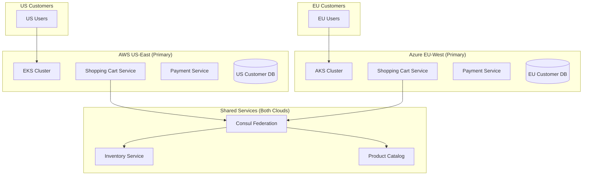
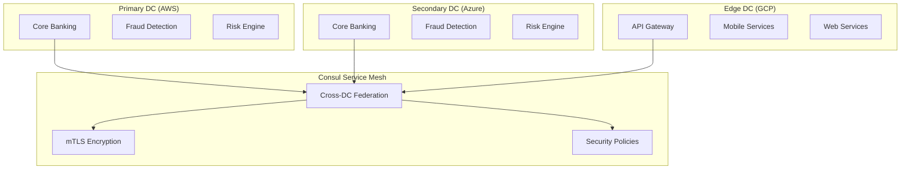
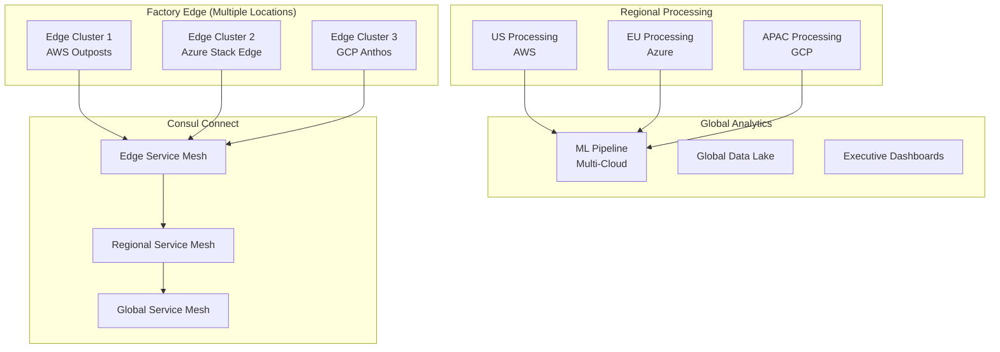
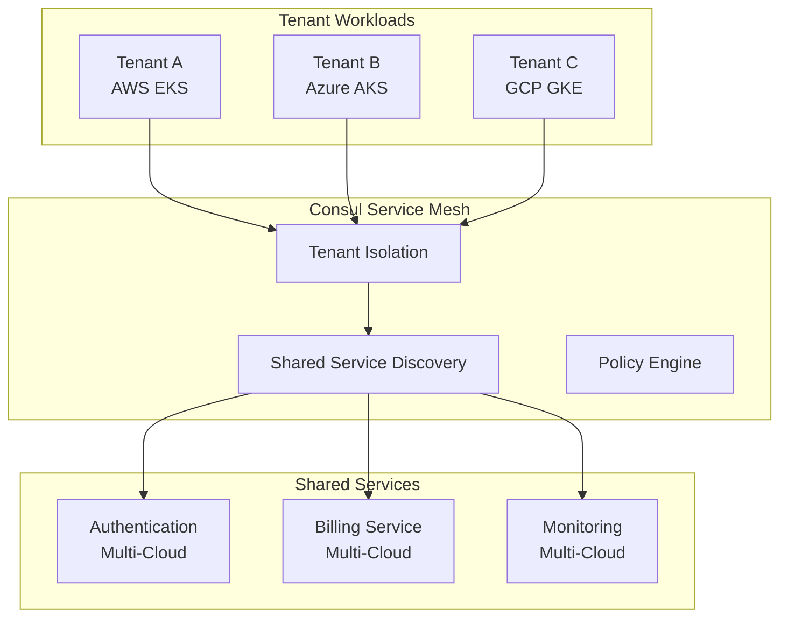

# Multi-Cloud Kubernetes + Consul: Real-World Use Cases

## **When Multi-Cloud K8s + Consul Actually Makes Sense** 🎯

### **Use Case 1: Global E-Commerce Platform**

#### **Business Requirements:**
```yaml
scenario: "Global retailer with regional data sovereignty"
traffic_pattern: "Active-Active across multiple regions"
compliance: "GDPR (EU), CCPA (US), PIPEDA (Canada)"
performance: "Sub-100ms response times globally"
```

#### **Architecture:**


#### **Why Consul is Essential:**
```yaml
cross_cloud_services:
  inventory_sync: "Real-time inventory across regions"
  catalog_updates: "Product catalog synchronization"
  pricing_engine: "Dynamic pricing across clouds"
  
service_discovery:
  scenario: "US cart service needs EU inventory data"
  consul_value: "Automatic discovery of EU inventory service"
  
load_balancing:
  scenario: "Route to least loaded inventory service"
  consul_value: "Intelligent cross-cloud routing"
```

### **Use Case 2: Financial Services Platform**

#### **Business Requirements:**
```yaml
scenario: "Multi-national bank with regulatory requirements"
compliance: "PCI-DSS, SOX, Basel III"
availability: "99.99% uptime (52 minutes/year downtime)"
disaster_recovery: "RTO < 15 minutes, RPO < 1 minute"
data_residency: "Customer data must stay in home country"
```

#### **Architecture:**


#### **Why Consul is Critical:**
```yaml
security_requirements:
  mtls_everywhere: "All service communication encrypted"
  zero_trust: "No service trusts another without verification"
  audit_trail: "Complete communication logs for compliance"
  
high_availability:
  cross_dc_failover: "Automatic failover between datacenters"
  health_checking: "Continuous service health monitoring"
  circuit_breakers: "Prevent cascading failures"
  
regulatory_compliance:
  service_segmentation: "Isolate PCI services from others"
  data_flow_control: "Ensure data doesn't cross boundaries"
  encryption_in_transit: "Meet regulatory encryption requirements"
```

### **Use Case 3: Media Streaming Platform**

#### **Business Requirements:**
```yaml
scenario: "Netflix-like streaming service"
global_scale: "100M+ users across 50+ countries"
performance: "Video start time < 2 seconds"
cost_optimization: "Use cheapest cloud per region"
content_delivery: "Geo-distributed content processing"
```

#### **Architecture:**
```mermaid
graph TB
    subgraph "Content Processing"
        AWS_ENCODE[Video Encoding<br/>AWS (GPU optimized)]
        AZ_TRANSCODE[Transcoding<br/>Azure (cost effective)]
        GCP_AI[AI Analysis<br/>GCP (ML services)]
    end
    
    subgraph "Global Distribution"
        AWS_CDN[CloudFront CDN]
        AZ_CDN[Azure CDN]
        GCP_CDN[Google CDN]
    end
    
    subgraph "Regional Services"
        US_API[US API Services<br/>AWS]
        EU_API[EU API Services<br/>Azure]
        APAC_API[APAC API Services<br/>GCP]
    end
    
    subgraph "Consul Mesh"
        CONSUL[Service Discovery]
        ROUTING[Intelligent Routing]
        METRICS[Performance Metrics]
    end
    
    AWS_ENCODE --> CONSUL
    AZ_TRANSCODE --> CONSUL
    GCP_AI --> CONSUL
    
    CONSUL --> ROUTING
    ROUTING --> US_API
    ROUTING --> EU_API
    ROUTING --> APAC_API
```

#### **Why Multi-Cloud + Consul:**
```yaml
cost_optimization:
  gpu_workloads: "AWS for GPU-intensive encoding"
  cpu_workloads: "Azure for cost-effective transcoding"
  ml_workloads: "GCP for advanced AI/ML services"
  
performance_optimization:
  content_routing: "Route to nearest processing center"
  load_balancing: "Distribute load across clouds"
  failover: "Automatic failover to backup regions"
  
vendor_diversification:
  risk_mitigation: "No single cloud dependency"
  negotiation_power: "Better pricing from vendors"
  feature_access: "Best-of-breed services from each cloud"
```

### **Use Case 4: IoT Platform for Manufacturing**

#### **Business Requirements:**
```yaml
scenario: "Industrial IoT platform for global manufacturer"
devices: "1M+ sensors across 500+ factories"
latency: "Edge processing < 10ms"
reliability: "99.9% uptime for production lines"
data_sovereignty: "Manufacturing data stays in country"
```

#### **Architecture:**


#### **Why Consul is Essential:**
```yaml
edge_computing:
  service_discovery: "Discover services across edge locations"
  health_monitoring: "Monitor edge cluster health"
  configuration_sync: "Sync configs across edge sites"
  
data_flow_management:
  routing_policies: "Route data based on sovereignty rules"
  load_balancing: "Balance load across processing centers"
  circuit_breakers: "Isolate failed edge locations"
  
operational_complexity:
  unified_observability: "Single view across all locations"
  policy_enforcement: "Consistent security policies"
  service_lifecycle: "Manage services across hybrid infrastructure"
```

### **Use Case 5: SaaS Platform with Tenant Isolation**

#### **Business Requirements:**
```yaml
scenario: "Multi-tenant SaaS platform (Salesforce-like)"
tenants: "10,000+ enterprise customers"
isolation: "Complete tenant data isolation"
compliance: "SOC2, HIPAA, FedRAMP"
scalability: "Auto-scale per tenant workloads"
```

#### **Architecture:**


#### **Why Multi-Cloud + Consul:**
```yaml
tenant_isolation:
  network_segmentation: "Complete network isolation per tenant"
  service_policies: "Tenant-specific access policies"
  compliance_boundaries: "Meet different compliance requirements"
  
cost_optimization:
  cloud_arbitrage: "Place tenants on cheapest suitable cloud"
  resource_optimization: "Optimize resources per tenant needs"
  vendor_negotiation: "Leverage multi-cloud for better pricing"
  
risk_management:
  vendor_diversification: "Reduce single cloud dependency"
  compliance_flexibility: "Meet various regulatory requirements"
  disaster_recovery: "Cross-cloud tenant failover"
```

## **Common Patterns Where Consul Adds Value**

### **✅ Active-Active Multi-Cloud**
```yaml
traffic_pattern: "50% AWS + 50% Azure (or geographic split)"
cross_cloud_calls: "Frequent service-to-service communication"
consul_value: "Service discovery, load balancing, health checks"
```

### **✅ Hybrid Cloud (Cloud + On-Premises)**
```yaml
infrastructure: "Kubernetes on-prem + cloud clusters"
connectivity: "Services span cloud and datacenter"
consul_value: "Unified service mesh across hybrid infrastructure"
```

### **✅ Multi-Region Active Deployments**
```yaml
deployment: "Active services in multiple regions"
communication: "Cross-region service dependencies"
consul_value: "Global service discovery and routing"
```

### **✅ Complex Microservices Architecture**
```yaml
services: "50+ microservices with complex dependencies"
security: "Zero-trust security requirements"
consul_value: "Service mesh benefits (mTLS, observability, policies)"
```

### **✅ Regulatory/Compliance Requirements**
```yaml
requirements: "Data sovereignty, audit trails, encryption"
complexity: "Different compliance per region/tenant"
consul_value: "Policy enforcement, traffic control, audit logging"
```

## **When NOT to Use Multi-Cloud + Consul**

### **❌ Simple Applications**
```yaml
architecture: "Monolith or simple microservices"
traffic: "Single region, single cloud"
recommendation: "Kubernetes native services"
```

### **❌ Active-Passive DR**
```yaml
traffic_pattern: "100% primary, 0% standby"
cross_cloud_calls: "None during normal operations"
recommendation: "DNS failover + simple monitoring"
```

### **❌ Cost-Sensitive Startups**
```yaml
priority: "Time to market and cost optimization"
complexity_tolerance: "Low"
recommendation: "Single cloud with simple architecture"
```

### **❌ Limited Operational Expertise**
```yaml
team_size: "Small team without DevOps expertise"
maintenance_capacity: "Limited operational bandwidth"
recommendation: "Managed services and simple architectures"
```

## **Decision Framework**

### **Use Multi-Cloud + Consul When:**
- ✅ **Active-Active traffic** across clouds
- ✅ **Cross-cloud service communication** required
- ✅ **Regulatory compliance** needs multi-region
- ✅ **Vendor diversification** is strategic priority
- ✅ **Complex microservices** with security requirements
- ✅ **Operational expertise** available for management

### **Skip Multi-Cloud + Consul When:**
- ❌ **Active-Passive DR** is sufficient
- ❌ **Single region** deployment meets needs
- ❌ **Simple architecture** with few services
- ❌ **Cost optimization** is primary concern
- ❌ **Limited operational** capacity
- ❌ **Fast time to market** is critical

**Bottom Line: Multi-cloud + Consul is powerful for complex, global, compliance-heavy applications but overkill for simpler use cases.**
