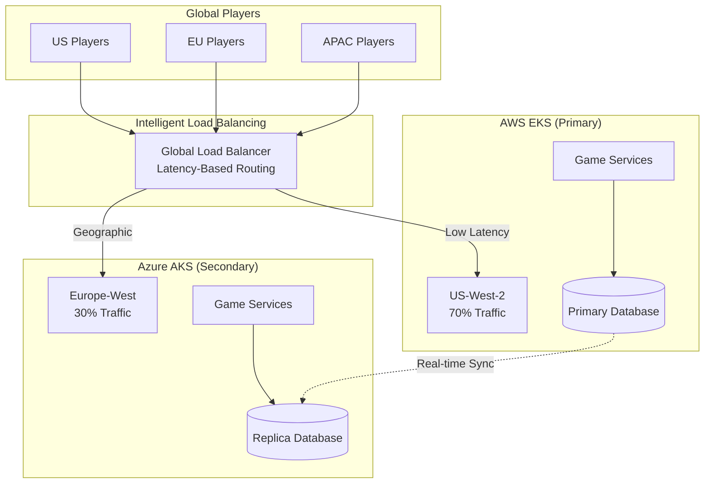
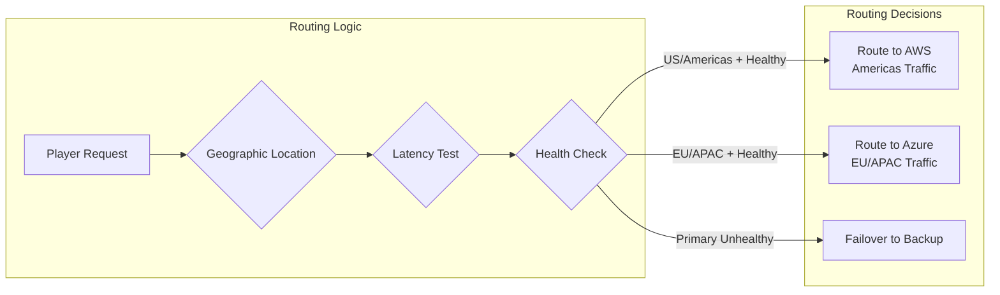
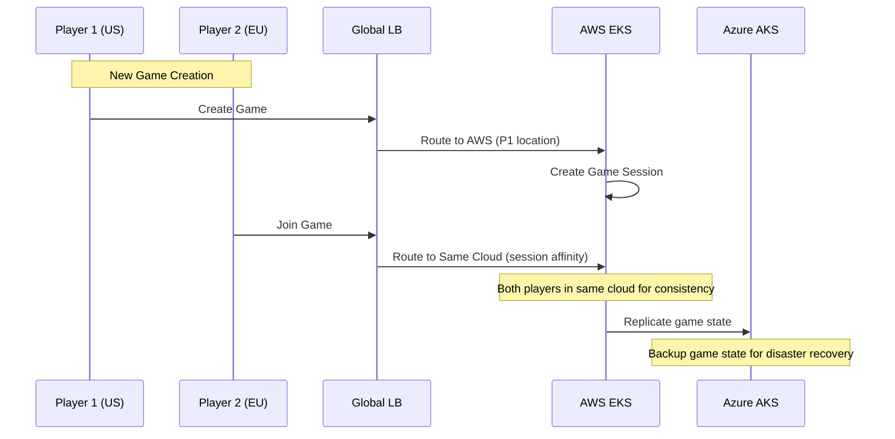

# Multi-Cloud Strategy for Gaming Platform

## **Recommended Approach: Hybrid Active-Active** 🎯

### **Gaming-Optimized Multi-Cloud Pattern**



## Strategy Comparison for Gaming

### **❌ Pure Active-Active (50/50) - Not Recommended**

**Why Not Ideal for Gaming:**
- **Data Consistency Issues**: Game state conflicts between clouds
- **Split-Brain Scenarios**: Players in same game on different clouds
- **Complex Synchronization**: Real-time game state sync is challenging
- **Higher Costs**: Full infrastructure duplication

### **❌ Pure Active-Passive (100/0) - Suboptimal**

**Why Limiting for Gaming:**
- **Global Latency**: EU/APAC players suffer high latency to US
- **Underutilized Resources**: Azure infrastructure sits idle
- **Single Point of Failure**: All traffic dependent on AWS
- **Poor Player Experience**: High latency affects gameplay

### **✅ Recommended: Geographic Active-Active (70/30)**

**Optimal Gaming Strategy:**
```yaml
traffic_distribution:
  aws_eks_primary:
    regions: ["US", "Americas"]
    traffic_percentage: 70%
    use_case: "Primary gaming workloads"
    
  azure_aks_secondary:
    regions: ["EU", "APAC"]  
    traffic_percentage: 30%
    use_case: "Regional optimization + DR"
```

## Implementation Architecture

### **Traffic Routing Strategy**


### **Game State Management**
```yaml
# Cross-cloud game state strategy
game_state_architecture:
  primary_database:
    location: "AWS RDS (US-West-2)"
    purpose: "Source of truth for all games"
    
  replica_database:
    location: "Azure Cosmos DB (Europe-West)"
    purpose: "Read replicas for EU/APAC players"
    sync: "Real-time replication"
    
  game_sessions:
    strategy: "Sticky sessions to origin cloud"
    failover: "Cross-cloud session migration"
    
  real_time_sync:
    method: "Consul KV + Event streaming"
    latency: "<50ms cross-cloud sync"
```

## Gaming-Specific Considerations

### **Player Experience Optimization**
```yaml
latency_requirements:
  same_region: "<20ms (excellent)"
  cross_region: "<50ms (acceptable)"
  cross_cloud: "<100ms (playable)"
  
routing_strategy:
  new_games: "Route to lowest latency cloud"
  existing_games: "Maintain cloud affinity"
  multiplayer: "All players in same cloud region"
```

### **Game Session Affinity**


### **Disaster Recovery Scenarios**
```yaml
failure_scenarios:
  aws_region_failure:
    action: "Failover all traffic to Azure"
    rto: "5 minutes"
    rpo: "30 seconds"
    
  azure_region_failure:
    action: "Route EU/APAC traffic to AWS"
    impact: "Higher latency but functional"
    
  cross_cloud_sync_failure:
    action: "Maintain regional isolation"
    fallback: "Manual reconciliation"
```

## Phased Implementation Plan

### **Phase 1: Single Cloud MVP (Month 1)**
```yaml
deployment:
  primary: "AWS EKS (US-West-2)"
  traffic: "100% to AWS"
  purpose: "Validate game mechanics and infrastructure"
  
benefits:
  - Simple data consistency
  - Faster development iteration
  - Lower operational complexity
```

### **Phase 2: Geographic Expansion (Month 2)**
```yaml
deployment:
  primary: "AWS EKS (US-West-2) - 70%"
  secondary: "Azure AKS (Europe-West) - 30%"
  routing: "Geographic-based with health checks"
  
benefits:
  - Improved global latency
  - Regional data compliance
  - Disaster recovery capability
```

### **Phase 3: Intelligent Routing (Month 3)**
```yaml
deployment:
  routing: "AI-powered latency optimization"
  features:
    - Dynamic traffic shifting
    - Predictive scaling
    - Cross-cloud game migration
    
benefits:
  - Optimal player experience
  - Cost optimization
  - Advanced resilience
```

## Cost Analysis

### **Geographic Active-Active (70/30)**
```yaml
monthly_costs:
  aws_primary:
    compute: "$800 (70% workload)"
    database: "$300 (primary RDS)"
    networking: "$200 (cross-cloud sync)"
    
  azure_secondary:
    compute: "$400 (30% workload)"
    database: "$150 (read replicas)"
    networking: "$100 (backup sync)"
    
  total: "$1,950/month"
  
cost_benefits:
  - 40% cheaper than full active-active
  - 60% better performance than active-passive
  - Optimal cost/performance ratio
```

## Monitoring & Observability

### **Cross-Cloud Metrics**
```yaml
key_metrics:
  player_experience:
    - cross_cloud_latency_p95
    - game_session_success_rate
    - player_connection_stability
    
  infrastructure:
    - cross_cloud_sync_lag
    - failover_time_seconds
    - regional_traffic_distribution
    
  business:
    - revenue_by_cloud_region
    - player_retention_by_latency
    - cost_per_active_user
```

### **Alerting Strategy**
```yaml
critical_alerts:
  - cross_cloud_sync_failure
  - regional_latency_degradation
  - player_connection_drops
  
automated_responses:
  - traffic_shifting_on_latency_spike
  - auto_scaling_based_on_player_load
  - failover_on_health_check_failure
```

## Recommendation Summary

**For Monopoly Go Gaming Platform:**

1. **Start Simple**: Single cloud (AWS) for MVP
2. **Add Geographic**: Azure for EU/APAC players (70/30 split)
3. **Optimize Routing**: Latency-based intelligent load balancing
4. **Maintain Affinity**: Keep game sessions within single cloud
5. **Plan Failover**: Cross-cloud disaster recovery capability

This approach provides **optimal player experience** while maintaining **operational simplicity** and **cost efficiency**.
