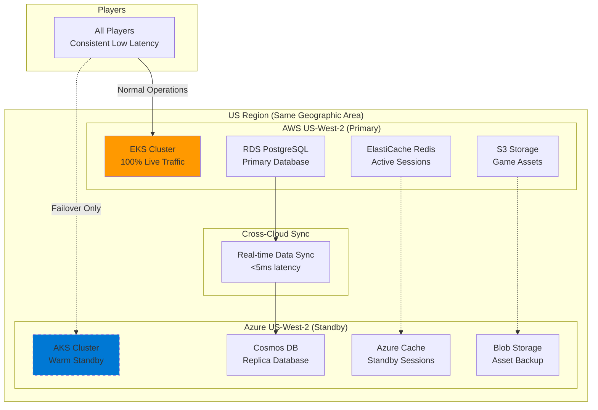
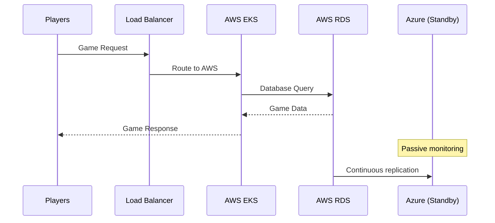
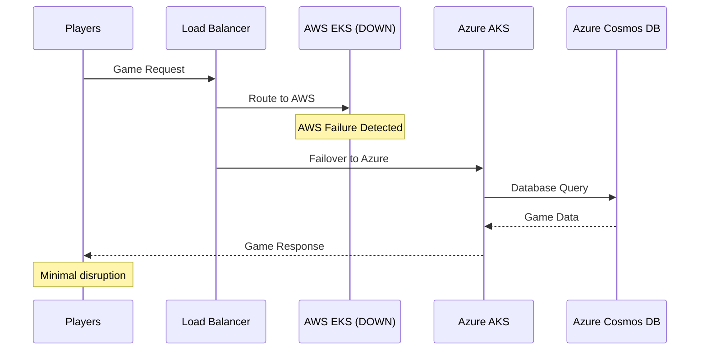

# Regional Active-Passive DR Strategy

## **Excellent Choice for Gaming Platform!** ✅

### **Architecture: Same-Region Multi-Cloud DR**



## **Why This Strategy is Perfect for Gaming**

### **✅ Gaming-Specific Advantages**

#### **1. Consistent Player Experience**
```yaml
latency_benefits:
  all_players: "Same region = consistent <20ms latency"
  no_geographic_split: "No EU vs US latency differences"
  failover_latency: "Minimal change during DR events"
  
player_experience:
  normal_operations: "Optimal performance on AWS"
  disaster_recovery: "Same performance on Azure"
  no_confusion: "Single region, predictable experience"
```

#### **2. Simplified Data Consistency**
```yaml
data_advantages:
  same_region_sync: "<5ms replication latency"
  no_split_brain: "Clear primary/secondary model"
  session_continuity: "Easy session migration"
  game_state_sync: "Real-time without geographic delays"
```

#### **3. Operational Simplicity**
```yaml
operational_benefits:
  single_timezone: "Operations team in one timezone"
  consistent_compliance: "Same data residency rules"
  simplified_networking: "No cross-region complexity"
  easier_debugging: "Single region troubleshooting"
```

## **Implementation Architecture**

### **Normal Operations (AWS Primary)**


### **Disaster Recovery Scenario**


## **Technical Implementation**

### **Data Replication Strategy**
```yaml
# Real-time data sync configuration
replication_setup:
  database:
    primary: "AWS RDS PostgreSQL"
    replica: "Azure Cosmos DB (PostgreSQL API)"
    sync_method: "Logical replication"
    lag_target: "<5 seconds"
    
  cache:
    primary: "AWS ElastiCache Redis"
    replica: "Azure Cache for Redis"
    sync_method: "Redis replication"
    lag_target: "<1 second"
    
  storage:
    primary: "AWS S3"
    replica: "Azure Blob Storage"
    sync_method: "Cross-cloud sync"
    lag_target: "<30 seconds"
```

### **Failover Automation**
```yaml
# Automated failover configuration
failover_triggers:
  health_checks:
    - aws_eks_api_unreachable
    - database_connection_failure
    - application_error_rate_high
    
  failover_process:
    detection_time: "30 seconds"
    dns_switch_time: "60 seconds"
    total_rto: "2 minutes"
    
  recovery_process:
    health_restoration: "Auto-detect AWS recovery"
    failback_method: "Manual approval required"
    data_reconciliation: "Automated sync"
```

### **Load Balancer Configuration**
```yaml
# Global load balancer setup
load_balancer:
  primary_endpoint: "aws-eks.monopoly-game.com"
  failover_endpoint: "azure-aks.monopoly-game.com"
  
  health_checks:
    interval: "10 seconds"
    timeout: "5 seconds"
    failure_threshold: 3
    
  failover_logic:
    method: "DNS-based failover"
    ttl: "60 seconds"
    automatic: true
```

## **Cost Analysis**

### **Monthly Cost Breakdown**
```yaml
aws_primary_costs:
  eks_cluster: "$150/month"
  worker_nodes: "$400/month (3x m5.large)"
  rds_database: "$200/month"
  elasticache: "$100/month"
  networking: "$50/month"
  total_aws: "$900/month"

azure_standby_costs:
  aks_cluster: "$75/month (minimal nodes)"
  standby_nodes: "$200/month (2x Standard_D2s_v3)"
  cosmos_db: "$100/month (replica)"
  azure_cache: "$50/month"
  networking: "$25/month"
  total_azure: "$450/month"

total_monthly: "$1,350/month"
cost_vs_single_cloud: "+50% for DR capability"
```

### **Cost Optimization**
```yaml
# Standby cluster optimization
azure_optimization:
  node_scaling:
    minimum: "2 nodes (basic availability)"
    maximum: "10 nodes (match AWS capacity)"
    scale_trigger: "Failover event"
    
  database_sizing:
    normal: "Minimal read replica"
    failover: "Auto-scale to match primary"
    
  cost_savings:
    standby_mode: "60% cheaper than active-active"
    on_demand_scaling: "Pay only when needed"
```

## **Disaster Recovery Testing**

### **Monthly DR Drills**
```yaml
# Regular failover testing
dr_testing:
  frequency: "Monthly"
  duration: "30 minutes"
  scope: "Full application stack"
  
  test_scenarios:
    - complete_aws_region_failure
    - database_failure_only
    - network_partition
    - partial_service_degradation
    
  success_criteria:
    rto: "<2 minutes"
    rpo: "<30 seconds"
    player_impact: "Minimal disruption"
```

### **Automated Testing**
```yaml
# Continuous DR validation
automated_tests:
  data_sync_validation:
    frequency: "Every 5 minutes"
    check: "Data consistency between clouds"
    
  failover_readiness:
    frequency: "Daily"
    check: "Azure cluster health and capacity"
    
  recovery_procedures:
    frequency: "Weekly"
    check: "Automated scripts and runbooks"
```

## **Gaming-Specific Benefits**

### **Player Session Continuity**
```yaml
session_management:
  normal_operations:
    storage: "AWS ElastiCache Redis"
    backup: "Real-time sync to Azure Cache"
    
  during_failover:
    migration: "Automatic session transfer"
    game_state: "Preserved in Azure Cosmos DB"
    player_impact: "Seamless continuation"
```

### **Game Performance**
```yaml
performance_benefits:
  latency_consistency: "Same region = predictable performance"
  no_cross_region_calls: "All services co-located"
  failover_performance: "Minimal degradation during DR"
  
gaming_advantages:
  real_time_gaming: "Consistent <20ms response times"
  multiplayer_sessions: "No geographic splitting"
  tournament_reliability: "High availability for events"
```

## **Recommendation Summary**

**This regional Active-Passive DR strategy is EXCELLENT for your gaming platform because:**

✅ **Simplified Operations**: Single region, single timezone
✅ **Consistent Performance**: All players get same low latency  
✅ **Cost Effective**: 50% cheaper than active-active
✅ **Gaming Optimized**: No data consistency issues
✅ **High Availability**: Robust DR without complexity

**Implementation Priority:**
1. **Phase 1**: Deploy AWS EKS primary (Month 1)
2. **Phase 2**: Add Azure AKS standby (Month 2)  
3. **Phase 3**: Implement automated failover (Month 3)

This approach gives you **enterprise-grade reliability** while keeping **operational complexity manageable** - perfect for a gaming startup scaling up!
