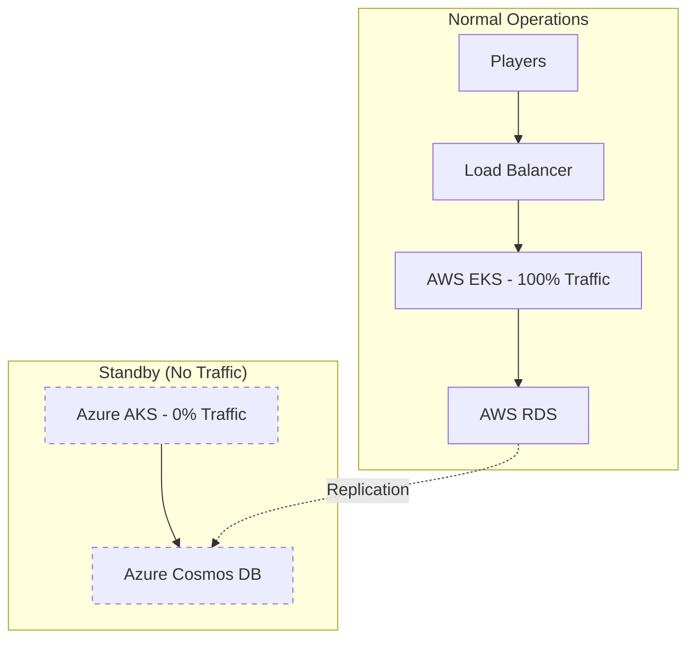

# Service Mesh Necessity Analysis: Active-Passive DR

## **TL;DR: Consul Service Mesh is NOT Required for Your Design** ❌

### **Your Current Architecture: Active-Passive DR**


**Key Point**: Azure is **completely passive** - no cross-cloud service communication needed!

## **Service Mesh Value Analysis**

### **❌ What Consul Service Mesh Provides (Not Needed)**

#### **1. Cross-Cloud Service Discovery**
```yaml
consul_feature: "Service discovery across AWS and Azure"
your_reality: "Azure services are dormant - no discovery needed"
necessity: "NOT REQUIRED"

example:
  consul_way: "AWS game-engine discovers Azure user-service"
  your_way: "All services run on AWS only (Azure is standby)"
```

#### **2. Cross-Cloud Load Balancing**
```yaml
consul_feature: "Intelligent routing between clouds"
your_reality: "100% traffic to AWS, 0% to Azure"
necessity: "NOT REQUIRED"

example:
  consul_way: "Route 70% to AWS, 30% to Azure"
  your_way: "Route 100% to AWS, failover switches to 100% Azure"
```

#### **3. Cross-Cloud mTLS**
```yaml
consul_feature: "Encrypted service-to-service communication"
your_reality: "No cross-cloud service calls in normal operations"
necessity: "NOT REQUIRED"

example:
  consul_way: "AWS game-engine → mTLS → Azure database"
  your_way: "AWS game-engine → AWS database (same cloud)"
```

### **✅ What You Actually Need (Simpler Solutions)**

#### **1. Internal Service Communication (Within Each Cloud)**
```yaml
# Instead of Consul Connect
alternatives:
  kubernetes_native: "Kubernetes Services + NetworkPolicies"
  istio_lite: "Istio (if you want service mesh benefits)"
  nginx_ingress: "NGINX Ingress Controller"
  
recommendation: "Kubernetes native services (simplest)"
```

#### **2. Health Monitoring & Failover**
```yaml
# Instead of Consul health checks
alternatives:
  kubernetes_probes: "Liveness/Readiness probes"
  prometheus_monitoring: "Prometheus + AlertManager"
  azure_monitor: "Azure Monitor + AWS CloudWatch"
  
recommendation: "Kubernetes probes + Prometheus"
```

#### **3. Configuration Management**
```yaml
# Instead of Consul KV
alternatives:
  kubernetes_configmaps: "ConfigMaps + Secrets"
  external_secrets: "External Secrets Operator"
  helm_values: "Helm chart configurations"
  
recommendation: "Kubernetes ConfigMaps (built-in)"
```

## **Simplified Architecture Without Service Mesh**

### **AWS EKS (Primary) - No Service Mesh Needed**
```yaml
# Simple Kubernetes-native setup
apiVersion: v1
kind: Service
metadata:
  name: game-engine
spec:
  selector:
    app: game-engine
  ports:
  - port: 80
    targetPort: 8080
  type: ClusterIP

---
apiVersion: v1
kind: Service  
metadata:
  name: user-service
spec:
  selector:
    app: user-service
  ports:
  - port: 80
    targetPort: 8080
  type: ClusterIP

# Services communicate via Kubernetes DNS
# game-engine calls: http://user-service/api/users
```

### **Azure AKS (Standby) - Identical Setup**
```yaml
# Exact same Kubernetes services
# No cross-cloud communication needed
# Services only activate during failover
```

### **Cross-Cloud Communication (Only During Failover)**
```yaml
# Simple DNS-based failover
failover_process:
  1. "Detect AWS failure"
  2. "Update DNS to point to Azure"
  3. "Scale up Azure services"
  4. "Players reconnect to Azure automatically"
  
# No service mesh required - just DNS switching
```

## **Cost & Complexity Comparison**

### **With Consul Service Mesh**
```yaml
additional_costs:
  consul_servers: "$150/month (3 servers per cloud)"
  consul_agents: "$50/month (sidecar overhead)"
  operational_overhead: "2-3 days/month maintenance"
  learning_curve: "2-4 weeks for team training"
  
total_overhead: "$200/month + significant complexity"
```

### **Without Service Mesh (Kubernetes Native)**
```yaml
costs:
  additional_infrastructure: "$0 (built into Kubernetes)"
  operational_overhead: "Minimal (standard K8s)"
  learning_curve: "None (team already knows K8s)"
  
total_overhead: "$0 + minimal complexity"
```

## **When You WOULD Need Service Mesh**

### **❌ Your Current Design (Active-Passive)**
```yaml
traffic_pattern: "100% AWS → 0% Azure"
cross_cloud_calls: "None during normal operations"
service_discovery: "Not needed across clouds"
mesh_value: "Minimal to none"
```

### **✅ If You Had Active-Active Design**
```yaml
traffic_pattern: "50% AWS → 50% Azure"
cross_cloud_calls: "Frequent service-to-service calls"
service_discovery: "Critical for routing"
mesh_value: "High - would be recommended"
```

### **✅ If You Had Multi-Region Active**
```yaml
traffic_pattern: "Geographic routing (US→AWS, EU→Azure)"
cross_cloud_calls: "Some cross-region communication"
service_discovery: "Needed for global services"
mesh_value: "Medium - could be beneficial"
```

## **Recommended Simplified Stack**

### **AWS EKS Primary**
```yaml
networking:
  ingress: "NGINX Ingress Controller"
  service_discovery: "Kubernetes DNS"
  load_balancing: "Kubernetes Services"
  security: "NetworkPolicies + RBAC"
  
monitoring:
  health_checks: "Kubernetes Probes"
  metrics: "Prometheus + Grafana"
  logging: "Fluent Bit → ELK"
  
configuration:
  config_management: "ConfigMaps + Secrets"
  secrets: "External Secrets Operator"
```

### **Azure AKS Standby**
```yaml
# Identical setup to AWS
# No additional service mesh complexity
# Activates only during failover
```

### **Cross-Cloud Components (Minimal)**
```yaml
failover_automation:
  health_monitoring: "External monitoring service"
  dns_failover: "Route 53 health checks"
  scaling_automation: "Azure CLI scripts"
  
data_replication:
  database: "AWS RDS → Azure Cosmos DB"
  cache: "Redis replication"
  storage: "S3 → Blob Storage sync"
```

## **Implementation Recommendation**

### **Phase 1: Start Simple (No Service Mesh)**
```bash
# Deploy basic Kubernetes services
kubectl apply -f k8s-services/
kubectl apply -f ingress-controller/
kubectl apply -f monitoring/

# Total setup time: 1-2 days
# Operational complexity: Low
# Cost: Minimal
```

### **Phase 2: Add Monitoring & Automation**
```bash
# Add comprehensive monitoring
helm install prometheus prometheus-community/kube-prometheus-stack
helm install external-secrets external-secrets/external-secrets

# Setup failover automation
./setup-dns-failover.sh
./setup-scaling-automation.sh

# Total setup time: 3-5 days
# Operational complexity: Medium
# Cost: Low
```

### **Phase 3: Consider Service Mesh Later (If Needed)**
```yaml
# Only add service mesh if you evolve to:
future_scenarios:
  - active_active_deployment
  - multi_region_expansion  
  - complex_microservices_communication
  - advanced_security_requirements
  
current_recommendation: "Skip service mesh for now"
```

## **Decision Matrix**

| Feature | Service Mesh | Kubernetes Native | Winner |
|---------|-------------|-------------------|---------|
| **Complexity** | High | Low | ✅ **K8s Native** |
| **Cost** | $200+/month | $0 | ✅ **K8s Native** |
| **Setup Time** | 2-4 weeks | 1-2 days | ✅ **K8s Native** |
| **Maintenance** | High | Low | ✅ **K8s Native** |
| **Team Learning** | Steep | Minimal | ✅ **K8s Native** |
| **Active-Passive DR** | Overkill | Perfect fit | ✅ **K8s Native** |

## **Final Recommendation**

### **✅ Skip Consul Service Mesh For Now**
**Reasons:**
- Your Active-Passive design doesn't need cross-cloud service communication
- Kubernetes native services handle intra-cloud communication perfectly
- Significant cost and complexity savings
- Faster time to market

### **🎯 Use This Simple Stack Instead**
```yaml
networking: "Kubernetes Services + NGINX Ingress"
monitoring: "Prometheus + Grafana + AlertManager"
security: "NetworkPolicies + RBAC"
configuration: "ConfigMaps + External Secrets"
failover: "DNS-based + Azure CLI automation"
```

### **🔮 Future Consideration**
Add service mesh later **only if** you evolve to:
- Active-Active multi-cloud (50/50 traffic split)
- Complex microservices requiring advanced routing
- Strict zero-trust security requirements

**Bottom Line: Start simple, add complexity only when you need the benefits!**
