# Architecture Diagram Tooling Strategy

## **Recommended Primary Stack** ✅

### **1. Mermaid (Markdown-Embedded)**
**Best for:** System flows, sequences, timelines, roadmaps

**Advantages:**
- ✅ **GitHub Native**: Renders directly in README files
- ✅ **Version Controlled**: Text-based, lives with code
- ✅ **Live Preview**: VS Code extensions for real-time editing
- ✅ **Multiple Types**: Flowcharts, sequences, Gantt, timelines
- ✅ **Zero Setup**: No additional tools required

**Usage Examples:**
```mermaid
# System architecture
graph TB
    A[Players] --> B[Load Balancer]
    B --> C[AWS EKS]
    B --> D[Azure AKS]

# Deployment timeline
gantt
    title Platform Roadmap
    section Infrastructure
    Multi-Cloud Setup: 2024-09-01, 30d
    Service Mesh: 2024-10-01, 45d
```

### **2. Diagrams.py (Python-Based)**
**Best for:** Infrastructure diagrams, cloud architecture

**Advantages:**
- ✅ **Auto-Generated**: Updates with infrastructure changes
- ✅ **Professional Icons**: Official AWS/Azure/GCP icons
- ✅ **CI/CD Integration**: Generate diagrams in pipeline
- ✅ **Consistent Style**: Standardized appearance

**Usage Example:**
```python
from diagrams import Diagram, Cluster
from diagrams.aws.compute import EKS
from diagrams.azure.compute import AKS

with Diagram("Multi-Cloud Platform"):
    eks = EKS("AWS EKS")
    aks = AKS("Azure AKS")
    eks >> aks
```

### **3. PlantUML (UML-Based)**
**Best for:** Detailed system interactions, component diagrams

**Advantages:**
- ✅ **Detailed UML**: Comprehensive system modeling
- ✅ **Text-Based**: Version controlled and diffable
- ✅ **Multiple Formats**: Sequence, component, deployment diagrams
- ✅ **Integration**: Works with IDEs and documentation tools

## **Implementation Strategy**

### **Documentation Structure**
```
/docs/
├── architecture/
│   ├── README.md                    # Overview with Mermaid diagrams
│   ├── system-architecture.md       # Detailed system design
│   ├── service-mesh.md             # Consul federation details
│   └── data-flow.md                # Data architecture
├── diagrams/
│   ├── system_architecture.py      # Diagrams.py infrastructure
│   ├── deployment_flow.py          # CI/CD pipeline diagrams
│   └── generated/                  # Auto-generated PNG files
├── roadmap/
│   ├── platform-evolution.md       # Mermaid timeline charts
│   └── technology-roadmap.md       # Technology adoption plan
└── operations/
    ├── runbooks/                   # Operational procedures
    └── monitoring/                 # Observability setup
```

### **Automated Workflow**
```yaml
# GitHub Actions integration
on: [push, pull_request]
jobs:
  generate-docs:
    steps:
      - name: Generate Diagrams.py
        run: python diagrams/system_architecture.py
      
      - name: Validate Mermaid syntax
        run: mmdc --input docs/ --output generated/
      
      - name: Commit generated diagrams
        run: git add diagrams/generated/ && git commit
```

## **Tool Comparison Matrix**

| Tool | Complexity | Maintenance | GitHub Integration | Professional Look | Learning Curve |
|------|------------|-------------|-------------------|-------------------|----------------|
| **Mermaid** | Low | Low | ✅ Native | Good | Easy |
| **Diagrams.py** | Medium | Low | ✅ CI/CD | Excellent | Medium |
| **PlantUML** | Medium | Medium | ✅ Plugins | Good | Medium |
| **Lucidchart** | Low | High | ❌ Manual | Excellent | Easy |
| **Draw.io** | Low | High | ⚠️ Limited | Good | Easy |

## **Specific Use Cases for Gaming Platform**

### **System Architecture (Diagrams.py)**
```python
# Multi-cloud gaming infrastructure
with Diagram("Gaming Platform Architecture"):
    with Cluster("AWS Production"):
        eks = EKS("Game Cluster")
        rds = RDS("Game Database")
    
    with Cluster("Azure Backup"):
        aks = AKS("Backup Cluster")
        cosmos = CosmosDB("Backup DB")
    
    players = Users("Players")
    players >> LoadBalancer("Global LB") >> [eks, aks]
```

### **Game Flow (Mermaid)**


### **Deployment Pipeline (Mermaid)**


### **Platform Roadmap (Mermaid)**


## **Maintenance Best Practices**

### **Weekly Tasks**
- ✅ **Auto-Generation**: Diagrams update with code changes
- ✅ **Link Validation**: Check for broken documentation links
- ✅ **Accuracy Review**: Validate diagrams match current architecture

### **Monthly Reviews**
- 📋 **Architecture Audit**: Comprehensive diagram review
- 📋 **Tool Evaluation**: Assess if tools meet current needs
- 📋 **Documentation Gaps**: Identify missing diagrams or docs
- 📋 **Team Training**: Share diagram updates with team

### **Quarterly Planning**
- 🎯 **Roadmap Updates**: Reflect completed and planned features
- 🎯 **Tool Upgrades**: Evaluate new diagramming tools
- 🎯 **Process Improvement**: Optimize documentation workflow
- 🎯 **Stakeholder Review**: Present architecture evolution to leadership

## **Integration with Development Workflow**

### **VS Code Setup**
```json
// .vscode/extensions.json
{
  "recommendations": [
    "bierner.markdown-mermaid",
    "plantuml.plantuml",
    "ms-python.python"
  ]
}
```

### **Pre-commit Hooks**
```yaml
# .pre-commit-config.yaml
repos:
  - repo: local
    hooks:
      - id: generate-diagrams
        name: Generate architecture diagrams
        entry: python diagrams/system_architecture.py
        language: python
        files: diagrams/.*\.py$
```

### **Documentation Site Integration**
```markdown
# README.md with live diagrams
## Architecture Overview


## Current Deployment Status

```mermaid
graph LR
    A[✅ AWS EKS] --> B[🚧 Service Mesh]
    B --> C[📋 Azure AKS]
```


## Quick Links
- [Live Monitoring](http://monitoring.monopoly-platform.com)
- [ArgoCD Dashboard](http://argocd.monopoly-platform.com)
- [Game Demo](http://game.monopoly-platform.com)
```

This tooling strategy ensures your architecture documentation stays current, professional, and maintainable while supporting your team's development workflow and stakeholder communication needs.
