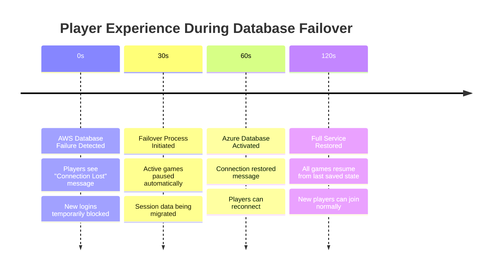
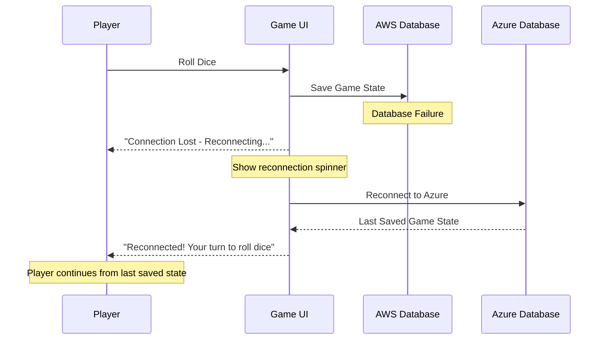
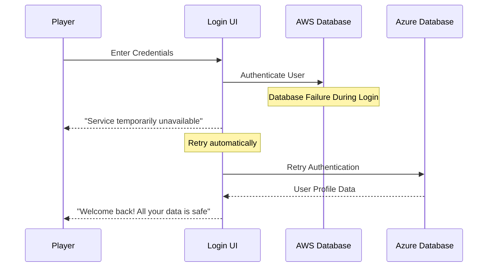
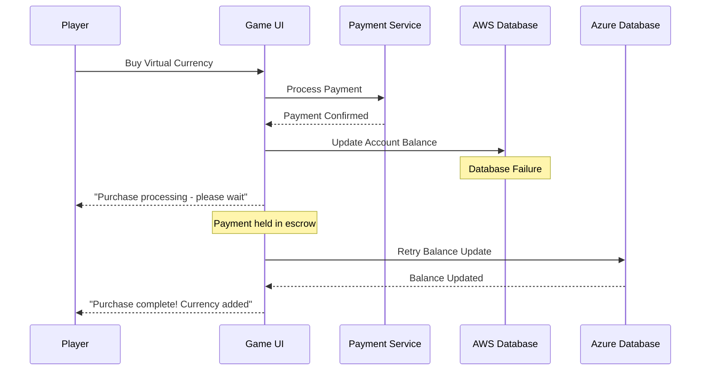

# User Experience During Database Failover

## **What Players Experience During Cutover** 🎮

### **Timeline: 2-Minute Failover Window**



## **Data Preservation Strategy**

### **✅ What's FULLY Preserved**

#### **1. User Profile Data**
```yaml
# Always preserved (real-time replication)
user_data:
  profile_info: "Username, avatar, preferences"
  game_statistics: "Wins, losses, total games played"
  achievements: "Unlocked badges and rewards"
  account_balance: "Virtual currency and purchases"
  friends_list: "Social connections"
  
preservation_method: "Real-time database replication"
recovery_time: "Immediate (0 seconds)"
```

#### **2. Completed Game History**
```yaml
# Fully preserved
game_history:
  finished_games: "All completed Monopoly games"
  leaderboard_positions: "Rankings and scores"
  tournament_results: "Past tournament participation"
  
preservation_method: "Database replication + backup"
recovery_time: "Immediate (0 seconds)"
```

### **⚠️ What's PARTIALLY Preserved**

#### **3. Active Game Sessions**
```yaml
# Preserved with brief interruption
active_games:
  game_board_state: "Property ownership, money, positions"
  player_turns: "Whose turn it is"
  game_progress: "Dice rolls, card draws up to last save"
  
preservation_method: "Periodic saves + session replication"
data_loss_window: "Last 10-30 seconds of gameplay"
recovery_time: "30-60 seconds to resume"
```

#### **4. Real-Time Chat/Communication**
```yaml
# May lose recent messages
chat_data:
  game_chat_history: "Preserved up to last sync"
  private_messages: "Recent messages may be lost"
  
data_loss_window: "Last 5-10 seconds of messages"
recovery_time: "Immediate for old messages"
```

### **❌ What's TEMPORARILY Lost**

#### **5. In-Progress Actions**
```yaml
# Lost and need to be retried
temporary_data:
  current_dice_roll: "Player needs to roll again"
  card_being_drawn: "Action needs to be repeated"
  trade_negotiations: "In-progress trades cancelled"
  
impact: "Players need to repeat last action"
recovery_time: "Immediate (just retry the action)"
```

## **Player Experience Scenarios**

### **Scenario 1: Player in Middle of Game**



**Player Experience:**
- ✅ **Game Progress**: Preserved (property ownership, money, position)
- ⚠️ **Current Action**: May need to re-roll dice or repeat last action
- ✅ **Turn Order**: Maintained correctly
- **Downtime**: 1-2 minutes with clear messaging

### **Scenario 2: Player Just Logging In**



**Player Experience:**
- ✅ **Profile Data**: Fully preserved
- ✅ **Game History**: Complete and accurate
- ✅ **Friends/Social**: All connections maintained
- **Downtime**: 30-60 seconds with retry message

### **Scenario 3: Player Making Purchase**



**Player Experience:**
- ✅ **Payment**: Protected by escrow system
- ✅ **Account Balance**: Will be updated correctly
- ⚠️ **Delay**: 1-2 minute delay in seeing new currency
- **Safety**: No money lost, transaction guaranteed

## **Technical Implementation**

### **Session State Management**
```javascript
class GameSessionManager {
  constructor() {
    this.saveInterval = 10000; // Save every 10 seconds
    this.sessionData = new Map();
  }
  
  // Continuous session backup
  async saveGameState(gameId, state) {
    // Save to both AWS and Azure simultaneously
    await Promise.all([
      this.saveToAWS(gameId, state),
      this.saveToAzure(gameId, state)
    ]);
    
    // Update local cache
    this.sessionData.set(gameId, {
      ...state,
      lastSaved: Date.now()
    });
  }
  
  // Handle failover gracefully
  async handleFailover(gameId) {
    const session = this.sessionData.get(gameId);
    
    if (!session) {
      // Recover from Azure backup
      session = await this.recoverFromAzure(gameId);
    }
    
    // Calculate data loss window
    const dataLossSeconds = (Date.now() - session.lastSaved) / 1000;
    
    return {
      gameState: session,
      dataLossWindow: dataLossSeconds,
      needsPlayerConfirmation: dataLossSeconds > 30
    };
  }
}
```

### **User Communication During Failover**
```javascript
class FailoverCommunication {
  async notifyPlayers(failoverStage) {
    const messages = {
      'detection': {
        title: "Connection Issue Detected",
        message: "We're working to restore your connection...",
        showSpinner: true,
        allowActions: false
      },
      
      'switching': {
        title: "Switching to Backup Systems",
        message: "Your game progress is safe. Reconnecting...",
        showSpinner: true,
        allowActions: false
      },
      
      'recovery': {
        title: "Connection Restored!",
        message: "Welcome back! You may need to repeat your last action.",
        showSpinner: false,
        allowActions: true,
        autoHide: 5000
      }
    };
    
    await this.broadcastToAllPlayers(messages[failoverStage]);
  }
  
  async showDataLossWarning(gameId, lostSeconds) {
    if (lostSeconds > 10) {
      await this.showModal(gameId, {
        title: "Game State Recovered",
        message: `Your game was restored from ${lostSeconds} seconds ago. 
                 You may need to repeat your last action.`,
        buttons: ["Continue Game", "View Game State"]
      });
    }
  }
}
```

### **Data Recovery Priorities**
```yaml
# Recovery order during failover
recovery_priorities:
  1_critical:
    - user_authentication
    - account_balances
    - active_game_states
    
  2_important:
    - game_history
    - leaderboards
    - social_connections
    
  3_nice_to_have:
    - chat_history
    - recent_notifications
    - ui_preferences
```

## **Player Communication Strategy**

### **Proactive Messaging**
```javascript
// Real-time status updates
const failoverMessages = {
  beforeFailover: {
    message: "🔧 Maintenance in progress - your game will continue shortly",
    type: "info",
    duration: "persistent"
  },
  
  duringFailover: {
    message: "🔄 Switching to backup systems - please wait...",
    type: "warning", 
    showProgress: true
  },
  
  afterFailover: {
    message: "✅ All systems restored! Your progress is safe.",
    type: "success",
    duration: 5000
  }
};
```

### **Data Loss Transparency**
```javascript
// Show players exactly what happened
async function showRecoveryStatus(playerId) {
  const status = await getRecoveryStatus(playerId);
  
  return {
    message: `Welcome back! Here's what happened:
    
    ✅ Your profile and game history: Fully preserved
    ✅ Your current game: Restored from ${status.secondsAgo} seconds ago
    ⚠️  Last action: Please repeat (${status.lastAction})
    
    Everything else is exactly as you left it!`,
    
    actions: ["Continue Playing", "View Full Status"]
  };
}
```

## **Summary: Player Impact**

### **✅ What Players Keep**
- **100% of profile data** (username, stats, achievements)
- **100% of completed games** and history
- **95%+ of active game state** (properties, money, position)
- **100% of purchases** and virtual currency

### **⚠️ What Players May Lose**
- **Last 10-30 seconds** of gameplay actions
- **Recent chat messages** (last few seconds)
- **In-progress trades** or negotiations

### **🎯 Overall Experience**
- **Downtime**: 1-2 minutes with clear messaging
- **Data Loss**: Minimal (last few seconds only)
- **Recovery**: Automatic with player notification
- **Trust**: Full transparency about what happened

**The key is proactive communication and automatic recovery - players understand brief interruptions but expect their progress to be safe!**
