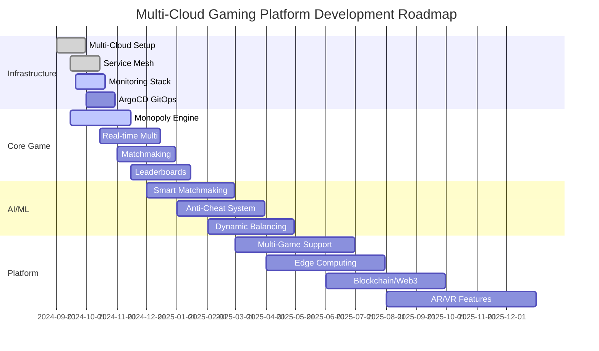
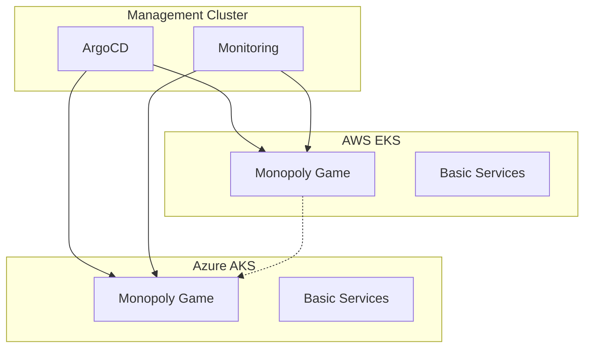
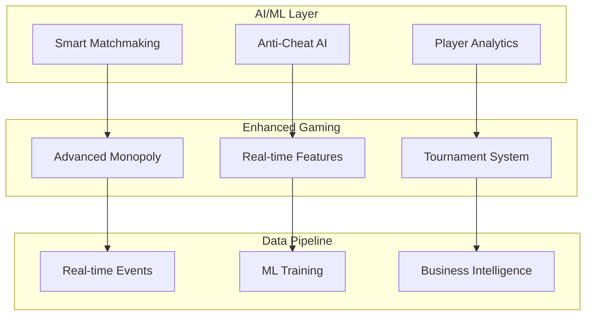
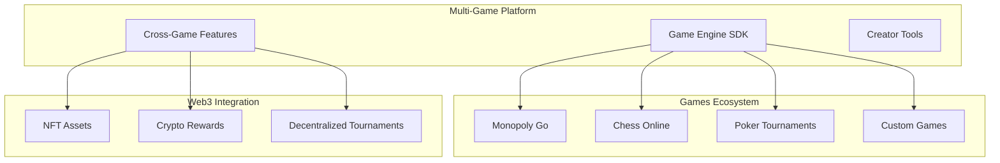
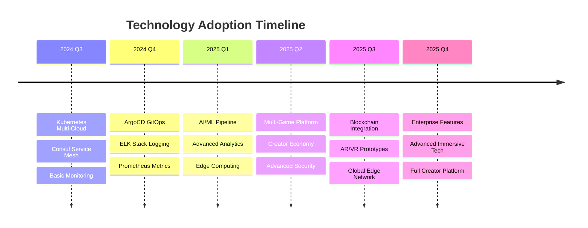
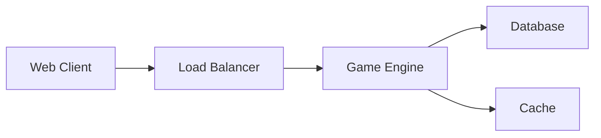
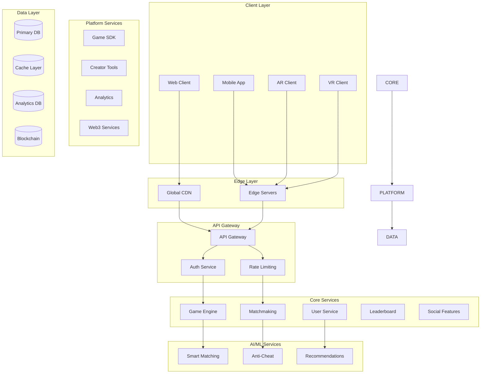
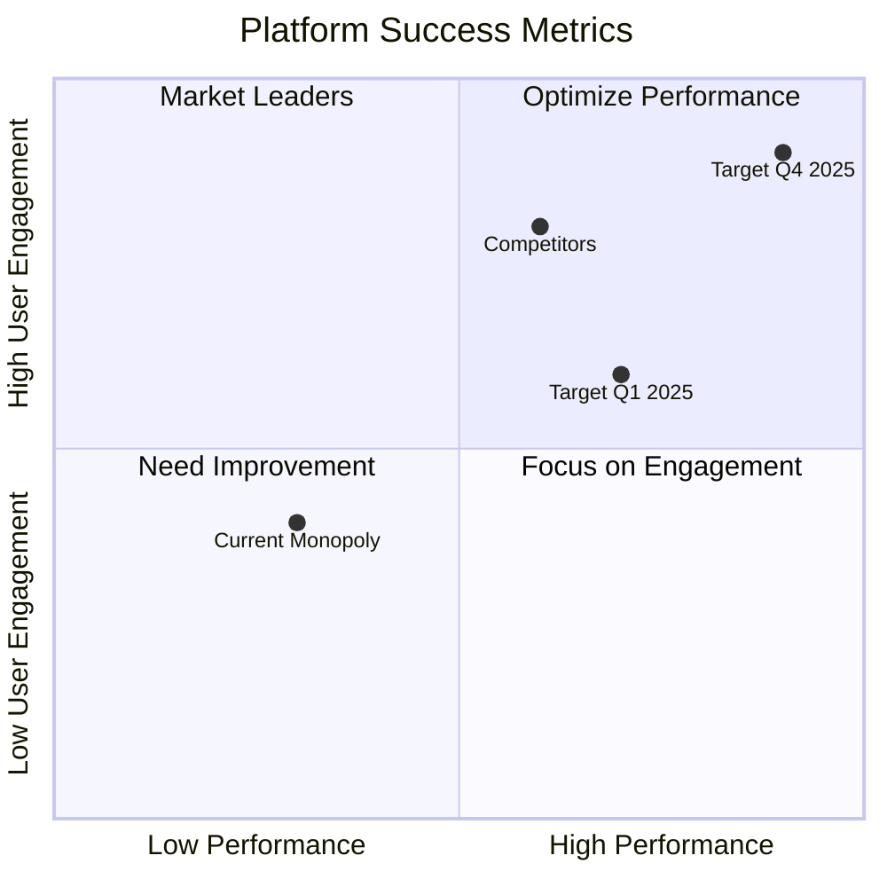

# Multi-Cloud Gaming Platform - Visual Roadmap

## Platform Evolution Timeline

## Architecture Evolution Phases

### Phase 1: Foundation (Current - Q4 2024)

### Phase 2: Intelligence (Q1-Q2 2025)

### Phase 3: Platform (Q3-Q4 2025)

## Technology Stack Evolution

## Service Architecture Maturity

### Current State (MVP)

### Target State (Full Platform)

## Success Metrics Dashboard

## Implementation Priorities

### High Priority (Next 3 Months)
- ✅ Complete multi-cloud infrastructure
- 🚧 Implement core Monopoly gameplay
- 📋 Deploy monitoring and observability
- 📋 Set up CI/CD pipeline with ArgoCD

### Medium Priority (3-6 Months)
- 📋 Add AI-powered matchmaking
- 📋 Implement real-time multiplayer features
- 📋 Deploy edge computing for performance
- 📋 Add comprehensive analytics

### Future Enhancements (6+ Months)
- 📋 Multi-game platform architecture
- 📋 Blockchain and Web3 integration
- 📋 AR/VR gaming experiences
- 📋 Enterprise and creator tools

This roadmap provides a clear visual progression from your current Monopoly Go game to a comprehensive multi-cloud gaming platform that can compete with industry leaders.
